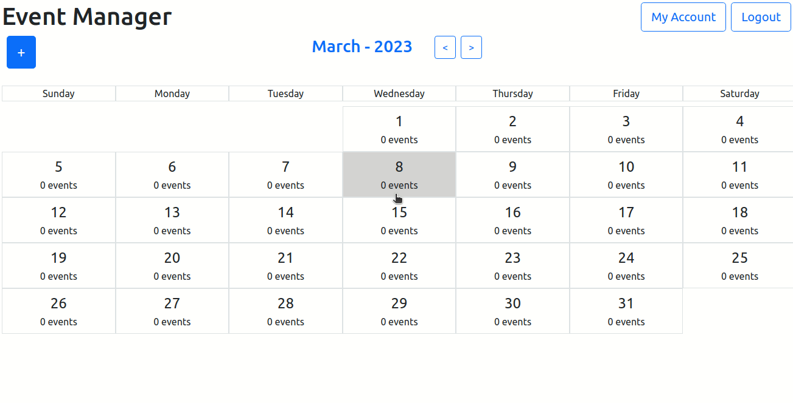

# Event Manager React

Website for event management (inspired by Google Calendar).

The backend (API) can be access [here](https://github.com/vitor-msp/event-manager-api)



## Execution

1. Clone this repository
```
git clone https://github.com/vitor-msp/event-manager-react.git
```

2. Access the downloaded folder
```
cd event-manager-react
```

3. Run the docker-compose

```
sudo docker-compose up -d
```

## Notes

1. The port 80 in your machine must be free